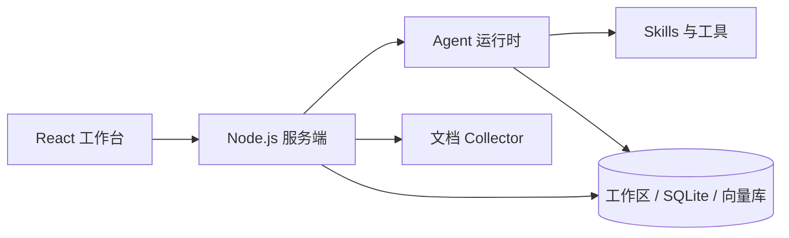

<p align="center">
  <picture>
    <source media="(prefers-color-scheme: dark)" srcset="./frontend/public/coregenie.svg">
    <source media="(prefers-color-scheme: light)" srcset="./frontend/public/coregenie-dark.svg">
    
  </picture>
</p>

<p align="center">
  面向 3GPP 标准研究的中文 Agent 工作台
</p>

<p align="center">
  <a href="https://github.com/acore2026/CoreGenie/issues">问题反馈</a>
  ·
  <a href="./AGENTS.md">开发约定</a>
  ·
  <a href="./LICENSE">MIT License</a>
</p>

# CoreGenie

CoreGenie 用来完成标准研究中重复、耗时、容易漏项的工作：查找会议资料、下载 TDoc、转换 Word、比较提案、追踪公司技术路线，并把结果保存成可以继续使用的中文报告。

项目当前重点支持 3GPP SA2 提案研究，同时保留文档问答、工作区知识库、模型接入和通用 Agent 工具。界面仅提供简体中文。

## 主要能力

| 能力             | 可以做什么                                                             |
| ---------------- | ---------------------------------------------------------------------- |
| 会议与 TDoc 查找 | 根据工作组、会议号、KI/WI、议程项、公司或 TDoc 编号定位官方资料        |
| 提案转 Markdown  | 下载或读取 DOCX，生成 Markdown、原图、嵌入对象和转换说明压缩包         |
| 提案对比         | 比较 Solution/Variant、网络功能、接口、信息元素、信令步骤和未决问题    |
| 公司路线分析     | 按会议整理 TDoc 和版本关系，追踪公司立场、术语和技术路线变化           |
| 会议结果检查     | 区分公司主张、共同署名文本、会议处理状态和正式结论                     |
| Agent 任务执行   | 按依赖关系拆分任务；独立任务可并行，已完成结果不会因单个任务失败而丢失 |
| 工作区知识库     | 上传资料、检索已有文档、保存最终报告，并在后续对话中继续使用           |

CoreGenie 不把公司提案自动写成 3GPP 已采纳结论。涉及通过、合并、推迟、撤回或形成 baseline 的判断时，需要查看会议报告和正式材料。

## 内置助手

| 助手                        | 默认状态 | 用途                                                                |
| --------------------------- | -------- | ------------------------------------------------------------------- |
| 3GPP 提案分析助手           | 启用     | 按会议或 KI 查找、下载、解析和比较 TDoc，生成中文报告并列出所用资料 |
| 3GPP 提案转 Markdown 助手   | 启用     | 将单份 DOCX 转换为 Markdown 和图片压缩包，不分析提案观点            |
| 3GPP 技术路线与立场分析助手 | 关闭     | 跨会议分析公司路线、术语演进、支持/反对关系；长任务稳定性仍在改进   |
| 通用助手                    | 关闭     | 日常问答和一般知识工作；管理员可在 Agent 设置中重新启用             |

助手通过 Skill 获得具体工作方法。当前内置的 3GPP Skill 包括：

- `3gpp-lookup`：查询会议时间、地点和目录等简短事实。
- `3gpp-review`：下载、筛选、转换和比较 TDoc。
- `3gpp-position-evolution`：跨会议整理公司立场和技术路线。

Skill 在需要时加载完整说明，不会把所有长指令一次性塞入每次对话。

## 一次提案分析如何完成

```text
任务范围
  ↓
确认会议目录与官方 Index
  ↓
生成 TDoc 清单并检查缺失项
  ↓
下载、解压并提取正文 / 表格 / 图片
  ↓
按提案分析并比较公司路线
  ↓
核对会议结果与引用资料
  ↓
生成中文 Markdown 报告并保存到工作区
```

运行过程会显示任务依赖、当前状态、工具调用、错误和部分结果。任务较多时，彼此独立的下载或分析步骤可以并行执行；有依赖的步骤会等待上游结果。

## 提问示例

### 分析一个 KI

```text
分析 SA2#175-AH-e KI#22 的全部提案。
按公司比较 Solution/Variant、关键流程、主要分歧和未决问题，
并核对会议处理结果。
```

### 追踪公司技术路线

```text
分析 Huawei 从 2025 年到最近一次已结束 SA2 会议在 KI#18
Agentic Core / NW-Agent 上的提案。
说明公司立场、技术路线、术语演进、主要反对者和会议结果。
```

### 转换单份提案

```text
请下载 S2-2606085，并转换成 Markdown 和图片压缩包。
```

也可以直接上传 `.docx`。转换助手只处理格式，不会总结观点，也不会把看不清的流程图改写成 Mermaid。

## Word 转 Markdown

转换流程优先使用 Pandoc 处理段落、标题、列表、表格、链接和常见行内格式，并通过 OOXML 解析补充 3GPP 文稿中的图片、VML/WPS 文本和嵌入对象。

每次转换会生成：

- Markdown 正文；
- `assets/` 中的原始图片；
- `embedded/` 中可导出的 Visio 或其他嵌入对象；
- `conversion-summary.json`，记录转换方式和警告；
- 包含上述内容的 ZIP。

LibreOffice 和 `pdftoppm` 可作为图形预览的可选工具。无法可靠读取的对象会保留原文件并写入警告，不会猜测图中内容。

## 快速开始：Docker

### 1. 获取代码

```bash
git clone https://github.com/acore2026/CoreGenie.git
cd CoreGenie
```

### 2. 准备配置

```bash
cp -n docker/.env.example docker/.env
```

打开 `docker/.env`，至少配置需要使用的聊天模型、嵌入模型和相关访问凭据。

### 3. 构建并启动

```bash
docker compose -f docker/docker-compose.yml up -d --build
```

启动后访问 `http://localhost:3001`。

默认持久化目录：

- 应用数据：`server/storage/`
- 待处理文件：`collector/hotdir/`
- 解析结果：`collector/outputs/`

容器访问宿主机上的 Ollama、LM Studio 或其他服务时，请使用 `host.docker.internal`，不要填写容器自身的 `localhost`。更多信息见 [Docker 使用说明](./docker/HOW_TO_USE_DOCKER.md)。

## 本地开发

### 环境要求

- Node.js 24.x
- Yarn 1.x
- Git
- Python 3（运行 3GPP 辅助脚本时需要）
- `curl`、`unzip`、`zip`、Pandoc
- Python 包 `lxml`、`openpyxl`

LibreOffice 和 `pdftoppm` 仅在需要生成部分嵌入图形预览时使用。

### 初始化

```bash
git clone https://github.com/acore2026/CoreGenie.git
cd CoreGenie
yarn setup
```

`yarn setup` 会安装 `server`、`collector` 和 `frontend` 的依赖，复制环境变量示例，生成 Prisma 客户端并初始化数据库。

首次运行前请检查：

- `server/.env.development`
- `collector/.env`
- `frontend/.env`

### 启动开发环境

```bash
yarn dev
```

也可以分别启动，方便查看日志：

```bash
yarn dev:server
yarn dev:collector
yarn dev:frontend
```

默认端口：

| 服务      | 地址                    |
| --------- | ----------------------- |
| 前端      | `http://localhost:3000` |
| 服务端    | `http://localhost:3001` |
| Collector | `http://localhost:8888` |

## 项目结构

```text
CoreGenie/
├── frontend/                 React + Vite 前端
├── server/                   Node.js 服务端与 Prisma 数据层
│   ├── agent-system/         Agent 规划、任务图、执行与恢复
│   └── agent-skills/         内置 Skill、脚本、参考资料和种子 Agent
├── collector/                文档采集、解析与格式转换
├── sandbox/                  隔离执行环境与 Broker
├── docker/                   Docker 镜像和 Compose 配置
└── .interface-design/        界面设计规范
```

主要运行关系：



## 常用检查命令

```bash
# 检查整个项目
yarn lint:ci

# 检查并构建前端
cd frontend
yarn lint:check
yarn build

# 检查服务端
cd server
yarn lint:check

# 运行指定测试
npx jest path/to/test.js --runInBand
```

修改 Agent、Skill、任务完成条件、工具权限或恢复逻辑时，请补充针对性测试。修改种子 Agent 时，同时更新种子版本和对应测试。

## 使用时请注意

- 最新会议、文档版本和处理状态会变化，应重新查看 3GPP 官方资料。
- 公司提案、共同署名文本和会议结论是不同层级的信息，报告中应分别说明。
- 流程图看不清、文档缺失或资料不完整时，助手会直接标记限制，不应补画或猜测。
- 自动报告仍需标准研究人员复核，尤其是会议状态、主要反对者和最终结论。
- 不要向外网部署的实例上传非公开或受限制的材料。

CoreGenie 是研究辅助工具，与 3GPP 没有隶属或授权关系。

## 参与开发

提交问题或建议前，请先搜索 [现有 Issues](https://github.com/acore2026/CoreGenie/issues)。代码修改请保持范围清楚，先运行相关测试，再提交 Pull Request。

项目开发约定见 [AGENTS.md](./AGENTS.md)。

## 上游项目与许可

CoreGenie 基于 Mintplex Labs 的 [AnythingLLM](https://github.com/Mintplex-Labs/anything-llm) 开发，保留了其模型接入、文档管理、多用户、向量数据库和 Agent 基础能力。

项目使用 [MIT License](./LICENSE)。AnythingLLM 及相关名称归原项目所有。
